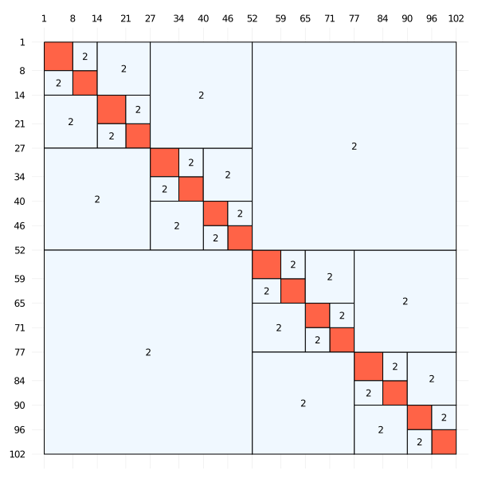

# HssMatrices.jl

[](https://github.com/bonevbs/HssMatrices.jl/actions)
[](http://codecov.io/github/bonevbs/HssMatrices.jl?branch=main)

`HssMatrices` is a Julia package for hierarchically semi-separable (HSS) matrices. These matrices are a type of hierarchically structured matrices, that arise in the context of solving PDEs numerically, among others. HssMatrices.jl is intendend to help users experiment with HSS matrices and related algorithms. HssMatrices.jl implements compression routines, HSS arithmetic, as well as helpful routines for clustering and visualization. These matrices have structures similar to the one in the illustration below.


## Getting started

Let us generate a simple Kernel matrix and convert it into HSS format:
```Julia
using LinearAlgebra
using HssMatrices

K(x,y) = (x-y) != 0 ? 1/(x-y) : 1.
A = [ K(x,y) for x=-1:0.001:1, y=-1:0.001:1]
hssA = hss(A)
```
This will automatically build a cluster tree and compress the matrix accordingly. `hss()` acts as a smart constructor, which will construct the matrix depending on the supplied matrix and parameters. We can either pass these parameters, for instance by doing:
```Julia
hssA = hss(A, leafsize=64, atol=1e-6, rtol=1e-6)
```
It can be handy to set default values for those parameters once and forget about them later on. This can be achieved bt doing:
```Julia
HssMatrices.setopts!(leafsize=64)
```

### Compression/Recompression
But what if you want to choose the compression algorithm yourself? Instead of calling `hss`, HssMatrices provides access to deterministic and randomized HSS compression routines, as well as the recompression routine. In order to call these, we first have to specify a clustering of the degrees of freedom. We provide the function `bisection_cluster`, to form a cluster tree of the degrees of freedom. If we use [AbstractTrees.jl](https://github.com/JuliaCollections/AbstractTrees.jl), we can also print them with `print_tree`:
```Julia
using AbstractTrees
cl = bisection_cluster(1:m, leafsize=32)
print_tree(cl)
```
Once we have created row- and column-clusters, we can move on to compress our matrix. Direct compression can be achieved by calling `compress`:
```Julia
rcl = bisection_cluster(1:m)
rcl = bisection_cluster(1:n)
hssA = compress(A, rcl, ccl, atol=1e-9, rtol=1e-9)
```
The tolerances in HssMatrices are handled in a way that the algorithms stop once either the absolute norm is below `atol` or once the relative norm is below `rtol`. In order to enforce that only one of the two criteria is met, we can set the other criterion to 0.

Apart from the direct compression routine, HssMatrices also implements the randomized compression routine developed by Per-Gunnar Martinsson. We can call this routine by either calling `randcompress` or `randcompress_adaptive`. The latter starts with a rank estimate of `kest=10` and increases the estimated rank of the random sampling until the estimate of the norm is below the respective tolerance.
```Julia
hssB = randcompress(A, rcl, ccl, kest=10);
hssB = randcompress_adaptive(A, rcl, ccl);
```
It is often useful to be able to call this indirect compression matrix without explicitly constructing a matrix. To this end, HssMatrices implements the `LinearMap`, type which is derived from the `LinearOperator` type defined in LowRankApproximation.jl. This type contains two functions for multiplication with the matrix and it's routine respectively, as well as one function for accessing individual indices of the `LinearMap`.
```Julia
Id(i,j) = Matrix{Float64}(i.*ones(length(j))' .== ones(length(i)).*j')
IdOp = LinearMap{Float64}(n, n, (y,_,x) -> x, (y,_,x) -> x, (i,j) -> Id(i,j))
hssI = randcompress(IdOp, ccl, ccl, 0)
```


Finally, basic arithmetic on hierarchical matrices often requires frequent recompression of the matrices in order to guarantee that the matrices remain efficient. This is implemented in src/compression.jl via the `recompress!` routine. 
```Julia
hssA = recompress!(hssA, atol=1e-3, rtol=1e-3)
```
All compression is handled in the sense that individual HSS block rows and columns approximate the original matrix A such that the tolerance is below `atol` of `rtol` for this block.

It can also be useful to construct HSS matrices from specific datastructures. For instance, we can construct an HSS matrix from a low-rank matrix in the following fashion:
```Julia
U = randn(m, k); V = randn(n,k)
rcl = bisection_cluster(1:m, lsz)
ccl = bisection_cluster(1:n, lsz)
hssA = lowrank2hss(U, V, rcl, ccl)
```

### Efficient HSS multiplication and division (inversion)
Of course we can now perform some arithmetic using HSS matrices. HssMatrices implements fast multiplication with dense and HSS matrices as well as fast solution of linear systems via the ULV factorization.
```Julia
hssA*x
hssA\x
```
These operations will automatically call the right routines for fast multiplication and fast matrix division. Moreover, we can also use HSS arithmetic to multiply Hss matrices with eachother and use left/right division on them:
```Julia
hssA+hssB
hssA-hssB
hssA*hssB
hssA\hssB
hssA/hssB
```
Do not forget to call recompression in order to keep the ranks low!
```Julia
recompress!(hssA)
```
### Convenience routines
We can also have a look at the generators and extract them via
```Julia
U1, V2 = generators(hssA, (1,2))
```
Another important information is the maximum off-diagonal rank. We can compute it using
```Julia
hssrank(hssA)
```
Alternatively, we can visualize the clustering and the off-diagonal ranks by calling
```Julia
plotranks(hssA)
```
This should generate an image similar to the one seen at the top of the page.

## Contribute
We would like to encourage users to share their problems, bugs and experiences so that we can keep improving the library.

## Acknowledgements
This library was inspired by the amazing package [hm-toolbox](https://github.com/numpi/hm-toolbox) by Stefano Massei, Leonardo Robol and Daniel Kressner. If you are using Matlab, I highly recommend to try this package.

In numerous occasions, members of the Julia Slack channel have helped me with the challenges of writing my first library in Julia. I would like to acknowledge their support.
